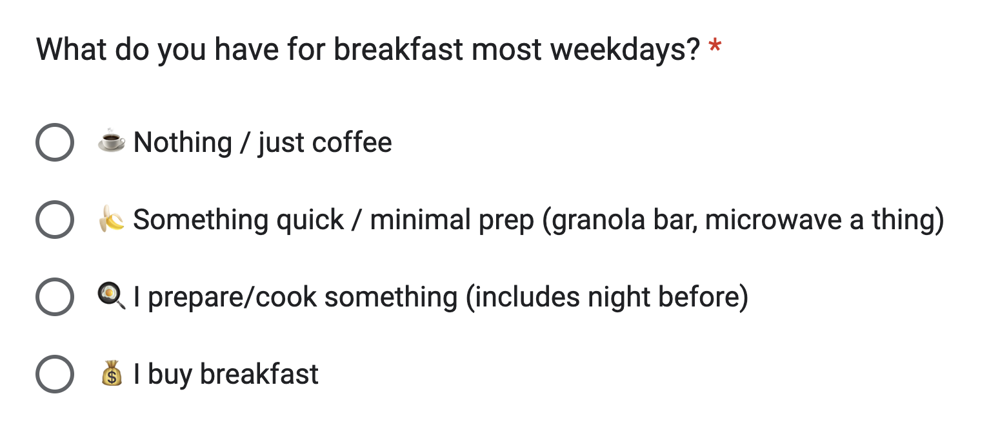
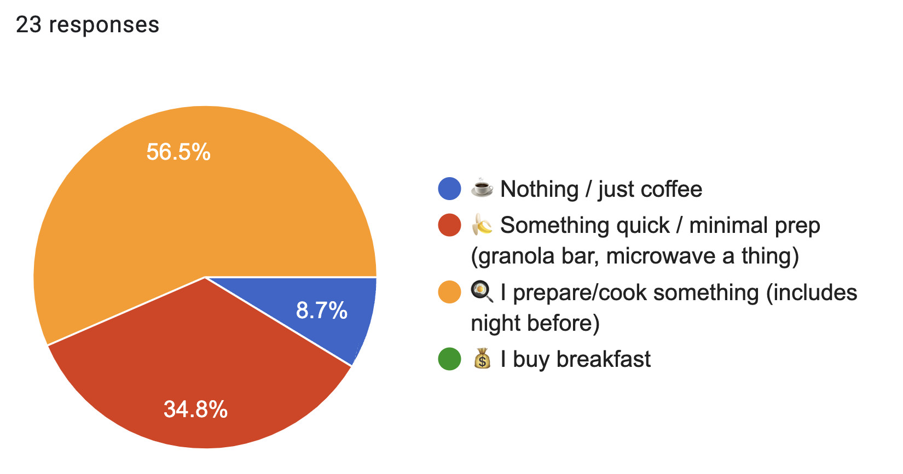
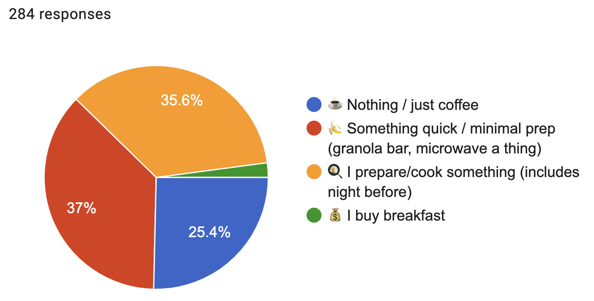
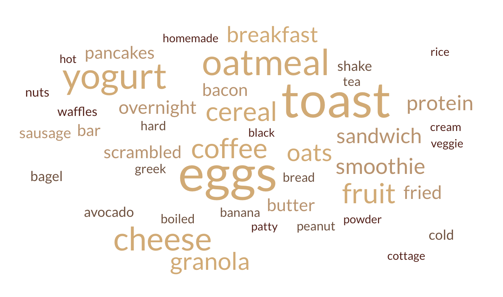
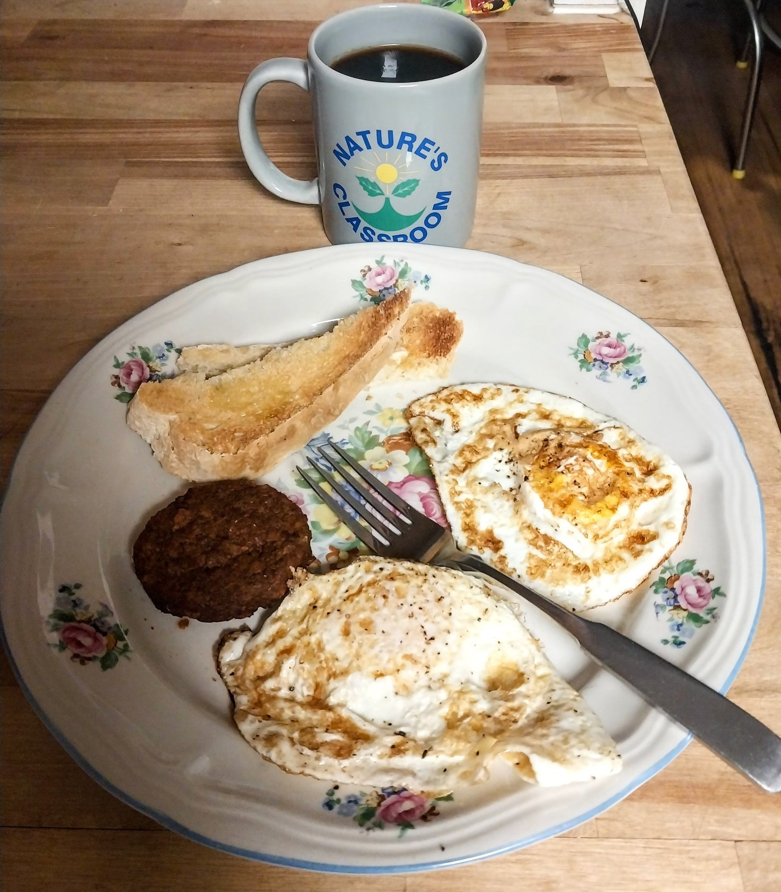

<h1 style="margin-bottom:0px">
 What do you have for breakfast?
</h1>

<meta property="og:image" content="images/word-cloud.png">

December 2nd, 2024 — <a href="assets/breakfast-responses.html" target="_blank" style="color:gray">read all survey responses</a> — <a href="assets/1_breakfast.csv" target="_blank" style="color:gray">download as CSV</a> 

## In my friend network

This all started because a friend mentioned they cook breakfast every morning and I thought that was INSANE. I asked 2 more friends and they said the same thing. I mostly only drink coffee in the mornings, so I needed to know: was I the weird one, or were they?

So I sent this survey to friends, and I now had empirical proof: **I am  the weird one**.

I still didn't _really_ believe these results though. I don't _feel_ like only having coffee in the morning is that weird. I was so sure it was more common. So I started wondering, what if it's not me, but them? What if I just have a weird group of friends??

## In my wider Ithaca network

I posted it [on r/ithaca](https://www.reddit.com/r/ithaca/comments/1h5s4oe/what_do_you_have_for_breakfast_most_days/
) and got over 200 responses! I also sent it to friends/family around the country. 

I was right. In the bigger sample, it's way more common to just drink coffee/not eat anything for breakfast:

- 🍌 (eat something minimal) 104
- 🍳 (cook breakfast) 101 
- ☕️ (just coffee / nothing) 72
- 💰 (buy it) 6

So, correction to the empirical proof: **I am not (that) weird** after all!!

<!-- I don't think the 6 people who 💰 buy breakfast most days are "the 1%", because, first of all, they are technically the 2%. Second,  -->

## What did people say about their breakfast?

There was a free form _"anything else you'd like to add?"_ section that 154 people filled out, writing a total of 3,553 words. I did some preprocessing to extract just the breakfast items from each response, and made a word cloud:

The top 5 breakfast items mentioned were: 

- egg (78)
- toast (46)
- oatmeal (44)
- yogurt (25) 
  - (exactly two people spelled it "yoghurt")
- cheese (21)
  - (cream (4), cottage (3), shredded (2))

You can <a href="assets/breakfast-responses.html" target="_blank">read all 154 survey responses here</a>. One of the themes that stuck out to me was how many responses were **"aspirational"**, talking about what they _WOULD_ love to do if they had time & energy:

> Best version of myself drinks an espresso w an unflavored seltzer. Two eggs over easy and a protein shake. Maybe a handful of blueberries. I usually end up with just the espresso and eggs, but I very rarely skip.

> If I’m being honest- most days are coffee. But I *intend* to eat breakfast every morning

> If I was prepared/motivated, I'd have avocado slices on a just egg patty with cholula hot sauce and slice of sourdough toast. But I usually never eat :)

Another theme I totally didn't expect was **seasonal breakfast routines**:

> oatmeal or quick poached egg with toast in winter, granola & yogurt & berries in summer

> We used to alternate between oatmeal in the winter and smoothie in the summer but for the past year and a half it’s been smoothie szn

> Microwave oatmeal in the winter, cereal in the summer

> Yogurt w/fruit and nuts OR smoothie for warm weather. Oatmeal or toast for cold weather. Eggs/pancakes for weekends (this is not seasonal weirdly)

Perhaps my favorite category is the people who not only treat themselves to a nice breakfast every morning, but also enjoy the process:

> Changes every few weeks---right now it's eggs & rice & kimchi! Cooking is often the most relaxing part of my day, so it's nice to spend time in the morning making something that tastes & feels good.

It's been over a year since my last phase of consistently making myself a nice breakfast. I work from home, I don't really have an excuse. I think I lost something when I let that habit go. Do I really have more important things to do, or do I feel like effort spent on myself is "not worth it"? 

I had a phase where I was really obsessed with Joe Pera. He had one episode called _Joe Pera Takes You To Breakfast_ that I must've watched a dozen times. I used to watch it after making myself a really nice bowl of oatmeal with all the berries & maple syrup. Not much really happens in this episode, other than Joe trying to decide what to have for breakfast, and asking the same question to his friends & loved ones.

    <video style="width: 100%; max-width:600px; border-radius: 15px;" src="assets/joe-pera-breakfast.mp4" autoplay="autoplay" muted loop playsinline></video>
    

        Opening scene of <a href="https://www.youtube.com/watch?v=gFmwV7_i4Lk" target="_blank" style="color:#555; text-decoration:underline">"Joe Pera Takes you to Breakfast"</a>. Joe is thinking about all the possibilities he could have at this diner. 
    

After running this survey I felt inspired to take that habit up again. It was nice to spend a few minutes in the kitchen before jumping straight to my laptop. I thought about how many of my friends are early morning people, perhaps preparing their breakfast _right now_ as I did mine. It made me feel a little closer, knowing I was joining them in this routine.

And just then I got a text from my neighbor, who I guess was having the exact same thought that I was having, at the same time. There were no words, just a picture:

It made me smile wide. Thank you for making my day, Liv. 

And thank _you_ for reading & filling out my silly little survey 💜

— Omar

<!-- 
NOTES

- seasonally!!
- I learned what my friends were, felt a sense of connection making my own breakfast
- how many were aspirational

- "why did it feel so good"

> I don’t know why it felt fun to type this out but it did.

- recommendations

> I drink smoothies, ensure, chobani, chatty cathy! (Best smoothies in ithaca is chatty Cathy)

- the funny stuff

> Either skip it entirely or a bowl of wheatabix / raisin bran (I promise I'm not 80)

> Cold Hawaiian pizza is the best breakfast food. I said what I said.

> breakfast is for weekends and vacations!

> 6 eggs, toast, blueberry/spinach smoothly. Every day for nearly 20 years

the greatest conviction!!!

> I ALWAYS eat breakfast. Never leave my house without eating. -->
